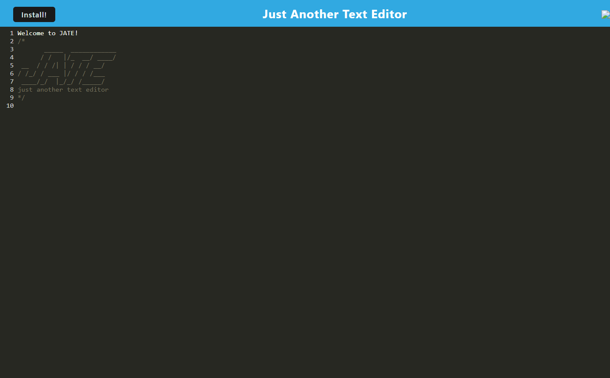

# NoSQL Network API
     

## Description

This project highlights the use of Mongoose DB and shows us how to initialize a NoSQL database with an application. With this application, you are able to create a user, which is stored inside the database located on the server in which the application is running. Add friends, thoughts, and reactions, just like some of your favorite social media apps, albeit, less intricate. It was created using Javascript, Mongoose, and Express. The most challenging aspect of this homework assignment was the fact that we did not create a front end. It really forces you to think about databases from a server-side state of mind. I learned a lot and I am very excited to bring this knowledge with me as we move into react.

---

## Table of Contents

Title --- NoSQL Network API
* [Description](#description)
* [Installation](#installation)
* [Usage](#usage)
* [License](#license)
* [Contributing](#contributing)
* [Tests](#tests)
* [Questions](#questions)

---

## Installation

npm I

---

## Usage

To launch the application, type npm start. Since there is no front end, API calls must be made through Insomnia or other database interface software.

---

## Screenshot

---

## License

This project is licensed under the MIT License.

---

## Contributing

Michael Reagan

---

## Tests

No testing capabilities at this time

---

## Questions

For questions or comments, please email me at Emparode@gmail.com.

My Github profile is located at [https://github.com/MCReagan](https://github.com/MCReagan).

---
